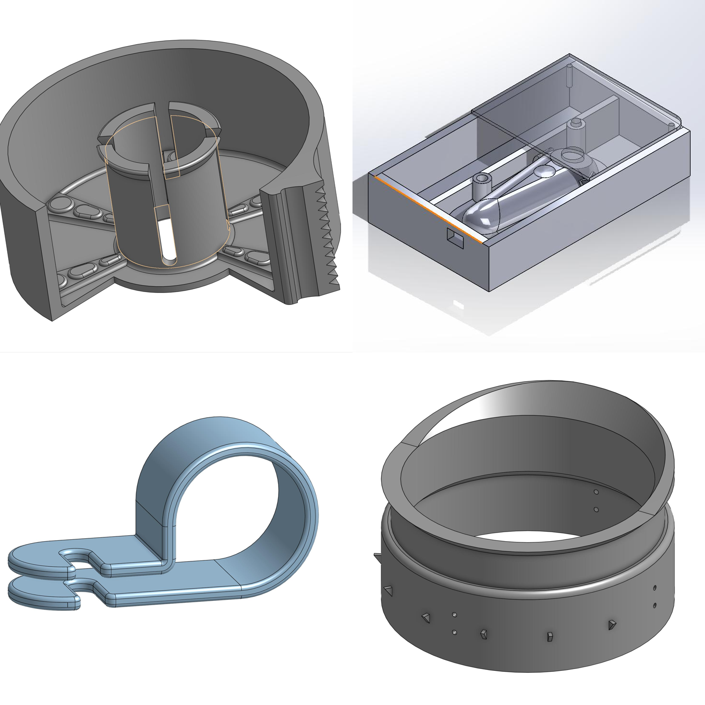
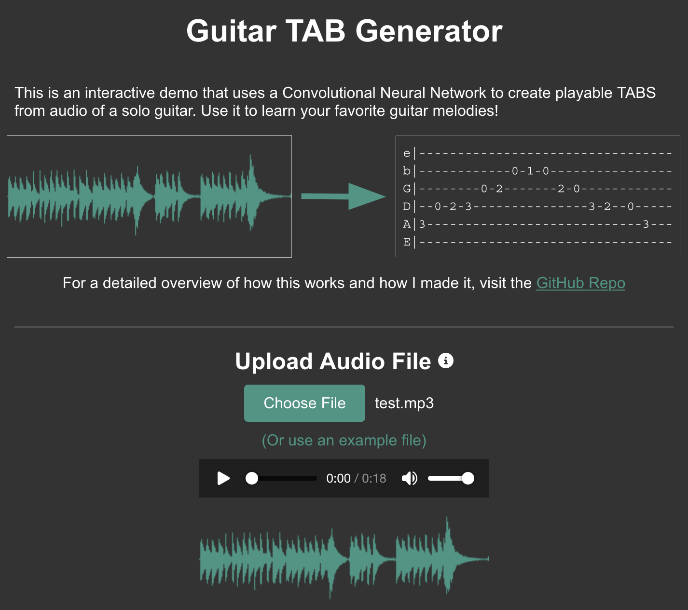
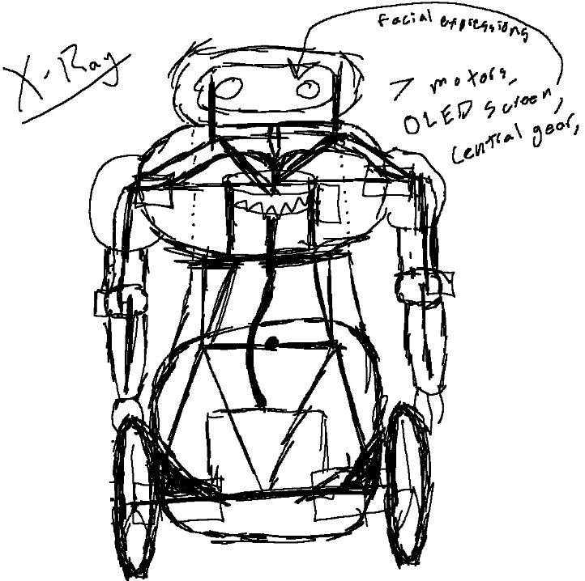
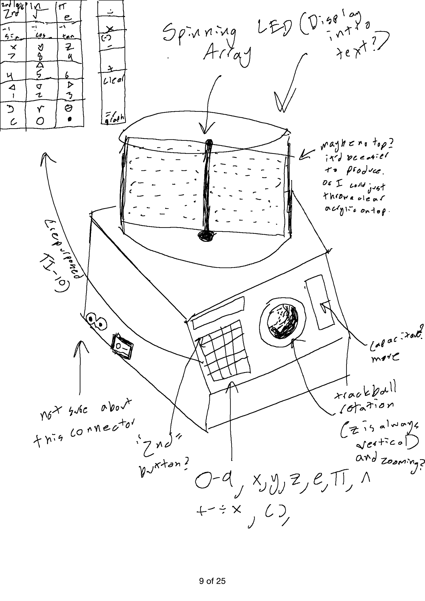
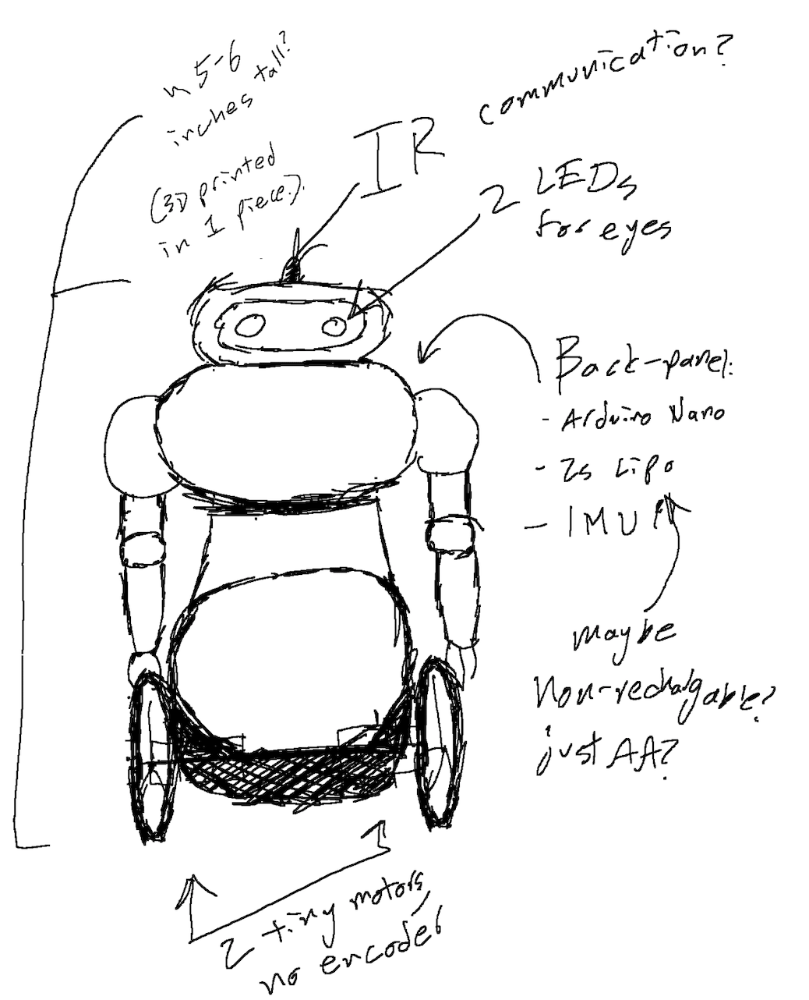
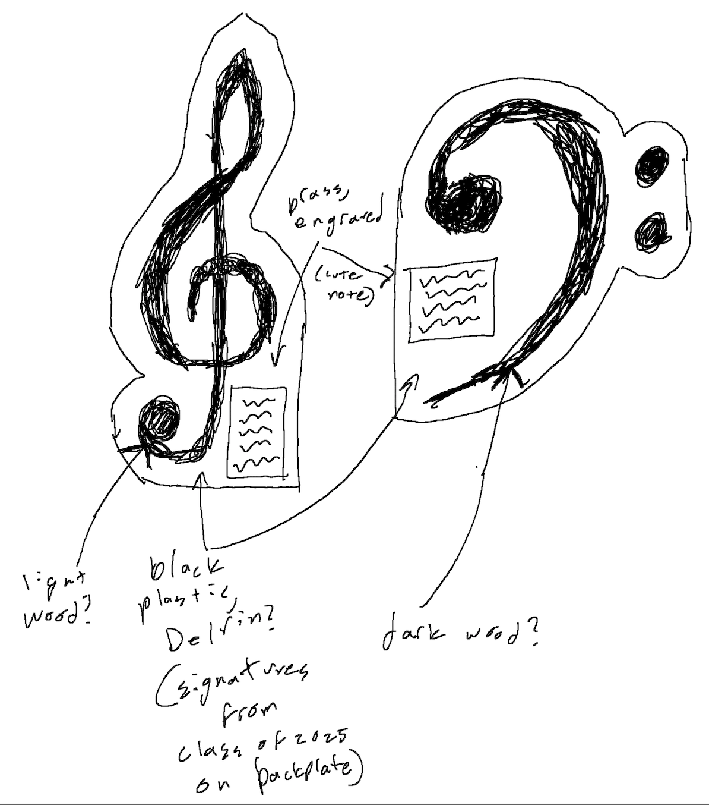

# Hi there, I'm Ryan!

## About Me

I'm a high school student who is determined to explore all things STEM.

  
My Engineering Past

   
  I started programming in the second semester of 9th grade. Quickly, I started working on silly side projects and quality-of-life automations, and suddenly I was a pretty sufficient programmer. Just a year after I wrote my first line of Python, I got a job at DupperAnalytics, a then-local business (now it spreads across the country). Working there, I progressed from basic technical staff to their head of AI Integrations, where now I design and build applications with LLMs and Computer Vision integrations for small businesses in need. It was a fantastic way for me to develop as a programmer, coworker, and leader. Currently I'm transitioning to a job at Bedrock Research, an ML-startup with a few PhD physicists from Lockheed Martin. In Spring of 2025 I'll be working in great depth with them to develop brand-new AI models to analyze satellite data, revolutionizing the tech available to small businesses and local governments, and perhaps even saving lives from wildfires. 

  
My Engineering Present

   
  This past summer, I realized that I need to pick a major. The problem is, I had such wide-ranging experience. I've loved 3D CAD and mechanical design since middle school, but now I've got industry experience and connections in software, web, and artificial intelligence development. Also, I self-studied AP Physics C: Electricity and Magnetism throughout my Junior year and now I have a sudden fascination for everything electronics. As a result, I've chosen Computer Engineering (or the closest thing to it) for each college I'm applying to, but there's a high chance I'll expand far beyond that field in my time as a college student. My current goal is to explore everything engineering-related through side-projects of mine, hopefully giving me a taste of what industry is like in each.

  
My Engineering Future

   
  I've already got moderate technical experience from my projects up until now. That means my time in college and beyond can be put towards improving my leadership and entrepreneurial abilities. I think I've got a head start on other people; I've already got a portfolio that could land me a high-paying job (it already has), so now I can focus on creating impactful inventions to help those around me. Given my high school record, you can be sure that I'll bring some amazing motivation and innovation to your college, on top of some radical bass playing. So, consider giving me a spot in your class of 2025 (and maybe a penny or two because my parents are paying for my two older brothers' college).

## Current Projects

I'm exploring engineering beyond the classroom through side projects, including a AI web-app and a AI robotics-system.

  
Mini-Projects

   
  Throughout high school I've been making tiny solutions to mild inconveniences. I suspect I'll continue this throughout my whole life. In the meantime, I've documented every single one of these in a GitHub Repo. If you want a sneak peek of my general engineering process, click through a few projects in the <a href="https://github.com/Giantryan484/Mini-Projects">repository</a>.
    
   

  
tabgenerator.app

   
  I've always loved music, and I've always been the guy my musician friends come to when they need something designed (or when they need help on their physics homework). I designed this tool for several of my beginner-guitarist friends, and it lets them upload audio of a guitar solo and have playable sheet music available to them in just a few button-clicks. The code and repo is available <a href="https://github.com/Giantryan484/Guitar-TAB-Generator">here</a>, and the website is live at <a href="https://tabgenerator.app/">https://tabgenerator.app/</a> (but may be at varying levels of functionality depending on when you visit it).
    
   

  
A Self-Balancing Robot

   
  Definitely my most ambitious project, I decided to build an AI-powered self-balancing robot to explore electronics, structural design, physics simulation, reinforcement learning, and robotics systems. I'm doing it alongside a fantastic programmer-buddy of mine, Asher Levin, so it's been a great way for me to practice collaborative learning and project management as well. This project is currently a work-in-progress, but I expect I'll have it in a semi-functional state by the end of November. Currently (as of 10/16/24), I'm waiting on gearmotors and threaded inserts from AliExpress. Scarce source code and pictures of the robot can be seen <a href="https://github.com/Giantryan484/Balancing-Robot">here</a>, but expect the repo to slowly have more and more content as the semester progresses.
    
  <em>Additionally, and I know this is a bit of a gimmick (but a fun one), this robot is run on a Raspberry Pi that receives movement instructions through a web server it hosts. So, in theory, and if you're at all interested, I could have you drive the robot remotely around my school with a live visual feed of what it sees sometime in December/January. If you want this to be a reality, contact me at <a href="mailto:ryan.m.mccormick2@gmail.com">ryan.m.mccormick2@gmail.com</a> and we can discuss it.</em>
    
   

## The Future

If you look at the second semester of my senior year, you might notice a strange class: "CTE Engineering/Tech Work-Based Learning". Simply put, I'm going to use this class to build tiny gifts for the teachers and friends that meant the most to me throughout high school. Here's a sneak peek of the projects I've planned out so far:

  
Volumetric Display 3D Grapher

   
  My amazing calculus teacher, Mrs. Allison, always jokes about how bad she is at drawing 3D graphs. So, I figured she could use an extra tool in the classroom. I'm going to make a device that can parse any 3D graph's equation (cartesian or polar) and display it in a tangible, volumetric display. This will be powered by a Raspberry Pi and the volumetric display will probably need to be a custom PCB.
    
   

  
Mini Self-Balancing Robot

   
  For my wonderful partner, Asher, I'm going to make him a miniature version of the robot we built together. For the big robot, I paid for every single thing with money from my job at DupperAnalytics, so we agreed I should get to keep it. Still, a tiny robot would still give him something fun to play with and remember. This will run on an Arduino Nano and a 2s LiPo battery. I'm going to replace the facial display with two RGB lights, and I'm going to make it controlled with an IR receiver/transmitter (which will be a fun way to learn some basic signal processing).
    
   

  
Musical Plaques

   
  This past year saw the biggest revolution in my school's music program since its beginnings, partially thanks to me. But most of the credit goes to our two amazing new Band and Orchestra directors, Mr. Green and Mr. Brax. To welcome them into the program and thank them for dealing with my excessive motivation throughout the school year, I want to make them some special, well-made plaques that celebrate their contributions to the program.
    
   

  
Misc.

   
  I've still got a few more people I want to build things for, but I haven't come up with solid ideas yet. Mr. Allison (yes, Mrs. Allison's husband) has also been really important to me because he's been cheering on my passion for mechanical design since middle school. Additionally, Dylan Willberg is a great musician friend of mine who also loves 3D CAD, and I want to make him something music/engineering related (I'm thinking perhaps a cello sculpture made out of misc. nuts/bolts with an integrated music box, to explore the artistic side of engineering).
    
  I'm also going to spend the second semester building the external panels of the robot (giving it a makeover). We'll give it more facial animations and probably give it a camera, ChatGPT integration, and maybe some Computer Vision experiments. My (rather grandiose) goal is to have this guy walk across stage with me at graduation, which would be unbelievably cool.  

